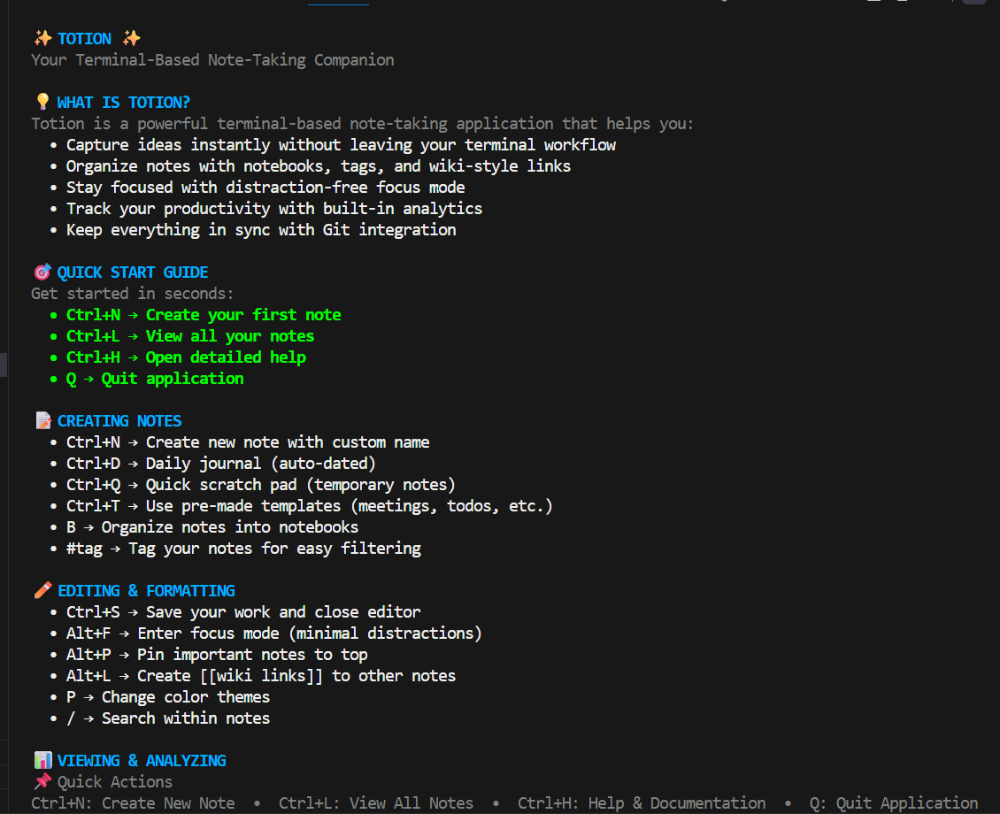
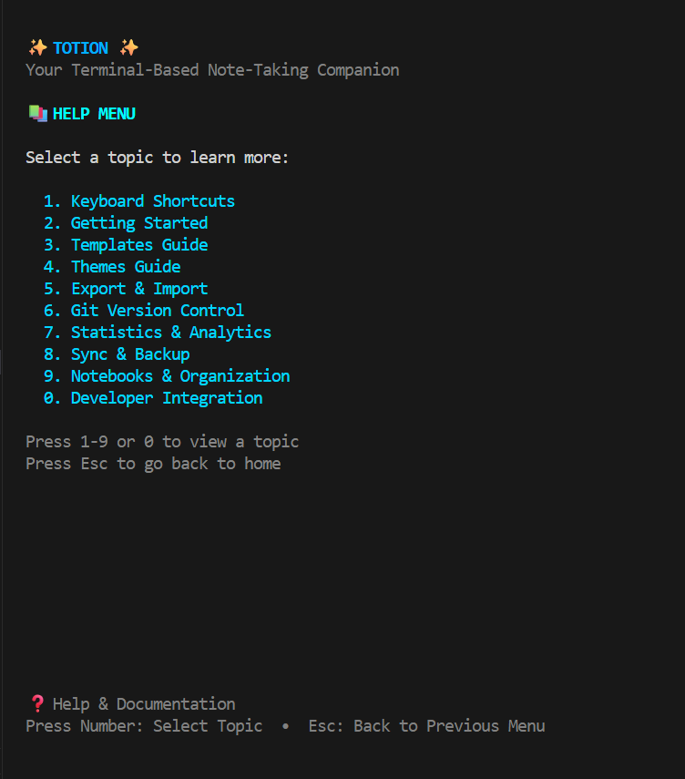

# ✨ Totion - Terminal Note-Taking TUI

A powerful, fast, and lightweight note-taking application for your terminal, built with Go and Bubble Tea.

## 🚀 Features

### Core Features ✅ (Fully Working)

- **Multi-Format Support**: Create notes in Markdown (.md) or Plain Text (.txt)
- **File Management**: Create, read, update, and delete notes with confirmation
- **Fast Search**: Quick filtering through your notes with `/` key
- **Keyboard-Driven**: Full keyboard navigation and shortcuts
- **Clean TUI**: Simple and intuitive terminal user interface with 2-3 colors
- **Templates**: 7 Quick note templates (Meeting, Todo, Journal, Project, Code, Book, Blank)
- **Themes**: 6 Color schemes available (Default Blue, Dark, Light, Monokai, Solarized, Nord)
- **Help System**: Comprehensive help with menu-based navigation (select topics 1-9)
- **Export**: Export notes to HTML, PDF, Plain Text, or Markdown formats
- **Import**: Import from Notion, Obsidian, or plain text files (.md/.txt from Git repos)
- **Statistics**: View word count, reading time, and vault statistics
- **Git Integration**: Initialize repo, commit changes, view history and status
- **Sync & Backup**: Full vault backup/restore with cloud sync support
- **Notebooks**: Organize notes in folders/notebooks for better structure
- **Wiki Linking**: Connect notes with `[[Note Title]]` syntax (Ctrl+K in editor)
- **Auto-Save**: Automatically saves notes every 30 seconds while editing
- **Recently Opened**: Quick access to your last 10 opened notes
- **Custom Templates**: Save your own note templates for reuse
- **Multi-Language UI**: Change interface language to 9+ languages with real-time translation powered by Lingo.dev (Spanish, French, German, Japanese, Chinese, Korean, Portuguese, Italian, Russian)

### Available Templates (Ctrl+T)

1. 📋 **Meeting Notes** - Structured meeting documentation
2. ✅ **Todo List** - Checkbox-based task list
3. � **Journal Entry** - Daily journal template
4. � **Project Plan** - Project planning structure
5. � **Code Snippet** - Code documentation template
6. 📚 **Book Notes** - Book reading notes
7. 📄 **Blank** - Empty template

### Available Themes (P key from home)

1. � **Default (Blue)** - Clean blue color scheme
2. **Dark** - Dark theme for night coding
3. ☀️ **Light** - Light theme for daytime
4. 🎭 **Monokai** - Popular Monokai colors
5. 🌊 **Solarized Dark** - Solarized dark palette
6. ❄️ **Nord** - Nord color scheme

## �️ Interface

Here's what Totion looks like in action:

### Home Screen

The main hub with pinned notes, quick start guide, and all available features.



### Notes List

Browse all your notes with easy navigation and search filtering.


### Editor

Clean, distraction-free writing environment with auto-save and markdown support.


### Help Menu

Comprehensive help system with organized topics and easy navigation.



## �📦 Installation

### Prerequisites

- Go 1.21 or higher
- Git (optional, for version control features)
- wkhtmltopdf (required for PDF export)
- Lingo.dev API key (optional, for UI translation feature)

```bash
go install github.com/0xshariq/totion
```

### Install wkhtmltopdf

**Ubuntu/Debian:**

```bash
sudo apt-get install wkhtmltopdf
```

**macOS:**

```bash
brew install wkhtmltopdf
```

**Windows:**
Download and install from: https://wkhtmltopdf.org/downloads.html

### Build from Source

```bash
# Clone the repository
git clone https://github.com/0xshariq/totion.git
cd totion

# Build the application
make build

# Run the application
make run

# Or install globally
make install

# Clean build artifacts
make clean
```

## 🎮 Usage & Keyboard Shortcuts

### Quick Start

1. **Launch Totion**: Run `./totion` or `make run`
2. **Create a note**: Press `Ctrl+N`, enter name, select format (Tab), press Enter
3. **Type your note**: Start typing immediately
4. **Save**: Press `Ctrl+S` to save and return home
5. **View notes**: Press `Ctrl+L` to see all notes
6. **Get help**: Press `Ctrl+H` or `?` anytime

### Complete Keyboard Reference

### Complete Keyboard Reference

#### 🏠 Home Screen Shortcuts

| Shortcut        | Action                                                 |
| --------------- | ------------------------------------------------------ |
| `Ctrl+N`        | Create new note with custom name                       |
| `Ctrl+D`        | Create daily journal note (auto-dated)                 |
| `Ctrl+Q`        | Open quick scratch pad                                 |
| `Ctrl+L`        | List all notes                                         |
| `Ctrl+H` or `?` | Show help menu (navigate with numbers, scroll with ↑↓) |
| `Ctrl+T`        | Open templates menu                                    |
| `P`             | Open themes menu                                       |
| `Alt+E`         | Export current note                                    |
| `Alt+I`         | Import notes from other apps                           |
| `S`             | View statistics dashboard                              |
| `G`             | Git operations menu                                    |
| `Alt+Y`         | Sync & backup menu                                     |
| `B`             | Notebooks/folders manager                              |
| `Alt+P`         | Pin/unpin note                                         |
| `/`             | Search notes                                           |
| `Alt+T`         | Change UI language (translate interface)               |
| `Q`             | Quit application                                       |

#### 📋 List View Shortcuts

| Shortcut  | Action                                   |
| --------- | ---------------------------------------- |
| `↑` / `↓` | Navigate notes up/down                   |
| `Enter`   | Open selected note for editing           |
| `Ctrl+D`  | Delete selected note (with confirmation) |
| `/`       | Start search/filter                      |
| `Esc`     | Clear filter or return to home           |

#### ✏️ Editor Mode Shortcuts

| Shortcut      | Action                               |
| ------------- | ------------------------------------ |
| `Ctrl+S`      | Save note and close editor           |
| `Alt+F`       | Toggle focus mode (distraction-free) |
| `Alt+P`       | Pin/unpin current note               |
| `Alt+L`       | Show wiki linking help               |
| `Esc`         | Discard changes and close editor     |
| Type normally | Edit note content                    |

#### 🌐 UI Language Translation (Press Alt+T anywhere)

Change the entire interface language with real-time translation powered by Lingo.dev!

| Key      | Action                                     |
| -------- | ------------------------------------------ |
| `Alt+T`  | Open language selector                     |
| `↑` `↓`  | Navigate through available languages       |
| `Enter`  | Change UI language to selected             |
| `Esc`    | Cancel language selection                  |

**Supported Languages:**

- 🇪🇸 Spanish (Español)
- 🇫🇷 French (Français)  
- 🇩🇪 German (Deutsch)
- 🇯🇵 Japanese (日本語)
- 🇨🇳 Chinese (中文)
- 🇰🇷 Korean (한국어)
- 🇵🇹 Portuguese (Português)
- 🇮🇹 Italian (Italiano)
- 🇷🇺 Russian (Русский)

**Features:**
- Translates ALL UI text: menus, buttons, help sections, and keyboard shortcuts
- Does NOT translate your note content - only the interface
- Real-time translation using Lingo.dev API
- Translation cache for fast performance
- Works from any screen (home, editor, help, etc.)

**Setup:**

1. Get a free API key from [lingo.dev](https://lingo.dev)
2. Create a `.env` file in your totion directory:
   ```bash
   LINGODOTDEV_API_KEY=your_api_key_here
   ```
3. Press `Alt+T` to start translating!

**Note:** If API key is not set, the app will work fine in English.

#### 📤 Export Menu (Press Alt+E from home)

| Key   | Format                                   |
| ----- | ---------------------------------------- |
| `1`   | Export to HTML (beautiful web page)      |
| `2`   | Export to PDF (requires wkhtmltopdf)     |
| `3`   | Export to Markdown (preserve formatting) |
| `Esc` | Cancel export                            |

#### 📥 Import Menu (Press Ctrl+I from home)

| Key   | Source                           |
| ----- | -------------------------------- |
| `1`   | Import from Notion (JSON export) |
| `2`   | Import from Markdown files       |
| `3`   | Import plain text files          |
| `Esc` | Cancel import                    |

#### 🔄 Git Menu (Press G from home)

| Key   | Action                    |
| ----- | ------------------------- |
| `1`   | Initialize Git repository |
| `2`   | Commit all changes        |
| `3`   | View commit history       |
| `4`   | View Git status           |
| `Esc` | Cancel                    |

#### ☁️ Sync & Backup Menu (Press Ctrl+Y from home)

| Key   | Action                        |
| ----- | ----------------------------- |
| `1`   | Backup vault to ZIP           |
| `2`   | Restore from backup           |
| `3`   | Sync to cloud (if configured) |
| `4`   | Sync from cloud               |
| `Esc` | Cancel                        |

#### 📝 Templates Menu (Press Ctrl+T)

| Key   | Template                                         |
| ----- | ------------------------------------------------ |
| `1`   | Meeting Notes - Structured meeting documentation |
| `2`   | Todo List - Checkbox-based task list             |
| `3`   | Journal Entry - Daily journal template           |
| `4`   | Project Plan - Project planning structure        |
| `5`   | Code Snippet - Code documentation template       |
| `6`   | Book Notes - Book reading notes & highlights     |
| `7`   | Blank Note - Start from scratch                  |
| `Esc` | Cancel                                           |

#### 🎨 Themes Menu (Press P from home)

| Key   | Theme                                 |
| ----- | ------------------------------------- |
| `1`   | Default (Blue) - Fresh and modern     |
| `2`   | Dark - Easy on the eyes               |
| `3`   | Light - High contrast                 |
| `4`   | Monokai - Popular developer theme     |
| `5`   | Solarized Dark - Classic color scheme |
| `6`   | Nord - Cool, bluish theme             |
| `Esc` | Cancel                                |

#### 📂 Notebooks Menu (Press B from home)

| Key   | Action                 |
| ----- | ---------------------- |
| `1`   | Create new notebook    |
| `2`   | List all notebooks     |
| `3`   | Rename notebook        |
| `4`   | Delete notebook        |
| `5`   | Move note to notebook  |
| `6`   | View notebook contents |
| `Esc` | Cancel                 |

#### ❓ Help & Documentation (Press Ctrl+H or ?)

In the help menu, press the corresponding number to view a topic:

| Key   | Topic                                       |
| ----- | ------------------------------------------- |
| `1`   | Keyboard Shortcuts - Complete key reference |
| `2`   | Getting Started - Beginner's guide          |
| `3`   | Templates Guide - Using note templates      |
| `4`   | Themes Guide - Customizing appearance       |
| `5`   | Export & Import - Moving notes in/out       |
| `6`   | Git Integration - Version control           |
| `7`   | Statistics - Analytics dashboard            |
| `8`   | Sync & Backup - Cloud sync setup            |
| `9`   | Notebooks - Organization system             |
| `0`   | Developer Integration - API documentation   |
| `Esc` | Return to previous menu or home             |

**Navigation in Help:**

- Use `↑↓` arrow keys or mouse scroll to navigate content
- Press `Esc` to go back to the previous menu
- All help sections now support scrolling!

## 🎮 Quick Start Guide

### First Time Setup

1. **Launch the app**:

   ```bash
   cd totion
   make run
   ```

2. **Create your first note**:

   - Press `Ctrl+N`
   - Type a name (e.g., "My First Note")
   - Press `Enter`
   - Press `Tab` to switch between Markdown/Text format
   - Press `Enter` again to create

3. **Start writing**:

   - Type your content in the editor
   - Press `Ctrl+S` to save and close

4. **View your notes**:

   - Press `Ctrl+L` to see all notes
   - Use arrow keys to navigate
   - Press `Enter` to open a note

5. **Get help anytime**:
   - Press `Ctrl+H` or `?`
   - Select a topic by pressing 1-9
   - Read the specific help for that feature
   - Press `Esc` to go back to menu or home

### Common Workflows

#### Creating Notes with Templates

1. Press `Ctrl+T` from home screen
2. Select a template (1-7)
3. Enter a note name
4. The template content will be loaded automatically
5. Edit and save with `Ctrl+S`

#### Deleting Notes

1. Press `Ctrl+L` to open notes list
2. Use arrow keys to navigate to the note
3. Press `Ctrl+D` to request deletion
4. Press `Y` to confirm or `N` to cancel

#### Using Wiki-Style Links

- In the editor, type `[[Note Name]]` to link to another note
- Press `Ctrl+K` to see linking help
- Links are detected automatically when editing

#### Importing from Other Apps

1. Press `I` from home screen
2. Select import source:
   - `1` for Notion (JSON export)
   - `2` for Obsidian vault
   - `3` for plain text files (.md/.txt from Git repos)
3. Follow the prompts

#### Version Control with Git

1. Press `G` from home screen
2. Initialize repository (first time): Press `1`
3. Commit changes: Press `2`
4. View history: Press `3`
5. Check status: Press `4`

#### Exporting Notes

1. Open a note in the editor
2. Press `E` from home screen
3. Select format: `1` HTML, `2` Plain Text, `3` Markdown
4. File will be exported to `/tmp/`

## 📁 File Structure & Storage

### Storage Location

Notes are stored in: `~/.totion/`

```text
~/.totion/
├── note1.md              # Markdown notes
├── note2.txt             # Plain text notes
├── project-notes.md      # More notes
└── meeting-notes.md      # Template-based notes
```

### File Formats

- **Markdown files**: `.md` extension - Full markdown support
- **Plain text files**: `.txt` extension - Simple text notes
- All files are human-readable plain text
- Easy to backup, sync, and version control
- Compatible with other markdown editors

### Backup Your Notes

Your notes are just files! You can:

- Copy `~/.totion/` folder to backup
- Use Git for version control (press `G` in app)
- Sync with cloud storage (press `Ctrl+Y` in app)
- Export individual notes to HTML/PDF (press `E` in app)

## 🛠️ Troubleshooting

### Application won't start

```bash
# Rebuild clean
make clean
make build
```

### Can't scroll in help screen

- Help is now menu-based - no scrolling needed!
- Press `Ctrl+H` to open help menu
- Select a topic (1-9) to see specific help
- Press `Esc` to go back to menu or home

### Can't type in editor

- Make sure you're in editor mode (file is open)
- Press `Esc` to exit any active filter/search
- Check that another app isn't capturing keyboard

### Notes not appearing in list

- Check `~/.totion/` directory exists
- Verify file extensions (`.md` or `.txt`)
- Press `Ctrl+L` to refresh list

### Export/Import not working

- Make sure you have a note open for export
- Check file paths for import sources
- Verify permissions on the target directories

## 📚 Tips & Best Practices

1. **Use Templates**: Press `Ctrl+T` for quick structured notes
2. **Keyboard First**: Learn shortcuts for fastest workflow
3. **Regular Backups**: Use Git (`G`) or Sync (`Ctrl+Y`) for backups
4. **Wiki Links**: Use `[[Note Name]]` to link related notes
5. **Search Often**: Use `/` in list view for quick filtering
6. **Simple Styling**: The app uses 2-3 colors for clean, readable interface
7. **Plain Text**: Notes are just files - easy to backup and portable

## 🗺️ Roadmap

### Current Status ✅

- [x] Core note-taking (Create, Read, Update, Delete)
- [x] Multi-format support (Markdown & Plain Text)
- [x] Search and filtering with `/`
- [x] Templates system (7 templates)
- [x] Themes system (6 themes)
- [x] Help system with menu-based navigation (no scrolling issues)
- [x] Export to HTML/Plain/Markdown
- [x] Import from Notion/Obsidian/Git
- [x] Statistics tracking
- [x] Git integration
- [x] Sync & backup
- [x] Notebooks/folders
- [x] Wiki-style linking
- [x] Simplified styling (2-3 colors)
- [x] Auto-save functionality

### Coming Soon 🚀

- [ ] Split view mode
- [ ] Better scrolling in all views
- [ ] Customizable key bindings
- [ ] Status bar with live stats
- [ ] Focus mode (distraction-free writing)
- [ ] Tag system for notes
- [ ] Full-text search across all notes

### Potential Real-World Features 💡

These features would make Totion more practical for everyday use:

#### Productivity Features

- **Daily Journal Automation** - Auto-create daily notes with date-based templates
- **Task Management** - Parse `- [ ]` checkboxes, track completion, show pending tasks
- **Meeting Minutes** - Quick capture meeting notes with attendees, agenda, action items
- **Quick Capture** - Rapid note entry mode (Ctrl+Q) for fleeting thoughts
- **Note Templates Library** - Expandable template system with custom user templates
- **Scheduled Notes** - Set reminders or schedules for notes (deadlines, follow-ups)

#### Organization Features

- **Tag System** - Add `#tags` to notes, filter by tags, tag cloud view
- **Favorites/Pins** - Pin important notes to the top of the list
- **Recently Opened** - Quick access to last 5-10 edited notes
- **Note Relationships** - Bidirectional links showing "what links here"
- **Archive System** - Archive old notes without deleting them
- **Note Categories** - Auto-categorize notes (work, personal, ideas, etc.)

#### Collaboration Features

- **Share Notes** - Export shareable links or QR codes for notes
- **Markdown Preview** - Live preview mode for markdown notes (Ctrl+M)
- **PDF Export** - Export notes to PDF with custom formatting
- **Presentation Mode** - Present notes full-screen with minimal UI
- **Note Comments** - Add inline comments/annotations without editing content

#### Advanced Writing Features

- **Word Count Goals** - Set daily writing goals, track progress
- **Writing Streaks** - Track consecutive days of writing
- **Spell Check** - Basic spell checking for text content
- **Auto-Complete** - Suggest completions based on note history
- **Snippets** - Quick insertion of frequently used text blocks
- **Markdown Shortcuts** - Quick formatting (Ctrl+B for bold, etc.)

#### Search & Discovery

- **Full-Text Search** - Search content across all notes (not just titles)
- **Fuzzy Search** - Find notes even with typos
- **Search History** - Remember recent searches
- **Smart Suggestions** - Suggest related notes based on content
- **Filter Combinations** - Filter by date + tag + type + folder

#### Integration Features

- **Browser Extension** - Save web clips to Totion
- **Mobile Companion App** - View/edit notes on mobile (read-only mode)
- **API Server** - REST API for external integrations
- **Webhook Support** - Trigger actions when notes are created/updated
- **Email Integration** - Email notes to yourself (to specific email address)
- **CLI Mode** - Command-line interface for scripting (`totion create "note name"`)

#### Smart Features

- **Auto-Tagging** - Suggest tags based on note content
- **Smart Links** - Auto-detect and highlight URLs, file paths, dates
- **Note Templates from Usage** - Learn from your writing patterns
- **Duplicate Detection** - Warn when creating similar notes
- **Broken Link Detection** - Find and fix broken wiki-style links

#### Performance & Reliability

- **Lazy Loading** - Load notes on demand for large vaults (1000+ notes)
- **Index Search** - Build search index for instant results
- **Auto-Backup** - Automatic daily backups with rotation
- **Conflict Resolution** - Handle sync conflicts gracefully
- **Undo/Redo** - Multi-level undo for edits (Ctrl+Z, Ctrl+Y)

#### Developer Features

- **Lua Plugins** - Scriptable plugins using Lua
- **Custom Themes** - Full theme customization (JSON-based)
- **Debug Mode** - Show performance metrics and logs
- **Export API** - Programmatic access to export functions
- **Webhooks** - Trigger external actions on events

### Most Requested Features (Priority)

Based on typical note-taking app usage, these would have the most impact:

1. ⭐ **Full-text search** - Search within note content, not just names
2. ⭐ **Tag system** - Organize and filter notes with tags
3. ⭐ **Task checkboxes** - Parse and manage `- [ ]` todo items
4. ⭐ **Markdown preview** - See formatted output while writing
5. ⭐ **Daily notes** - Auto-create today's journal entry
6. ⭐ **Mobile view** - Sync and view on mobile devices

## 🤝 Contributing

Contributions are welcome! The codebase is well-structured and modular.
Refer [CONTRIBUTING.md](CONTRIBUTING.md)

### Project Structure

```text
totion/
├── cmd/totion/              # Entry point (main.go)
├── internal/
│   ├── app/                 # Main application logic
│   │   ├── app.go          # Core Model, Init, Update
│   │   ├── handlers.go     # All handler functions
│   │   └── views.go        # View rendering
│   ├── models/             # Data models (Note, FileFormat)
│   ├── storage/            # File operations (CRUD)
│   ├── ui/
│   │   ├── components/     # Reusable UI components
│   │   ├── help/           # Help content
│   │   └── styles/         # Simple color styling (2-3 colors)
│   ├── features/           # Advanced features
│   │   ├── export/         # Export to HTML/Plain/Markdown
│   │   ├── import/         # Import from Notion/Obsidian
│   │   ├── git/            # Git version control
│   │   ├── sync/           # Backup and sync
│   │   ├── stats/          # Statistics tracking
│   │   ├── linking/        # Wiki-style links
│   │   └── templates/      # Note templates
│   ├── notebook/           # Folder/notebook management
│   └── themes/             # Theme system
├── go.mod                  # Dependencies
├── makefile                # Build commands
└── README.md               # This file
```

### Code Organization

The codebase follows clean architecture principles:

- **Separation of Concerns**: `app.go` (core), `handlers.go` (logic), `views.go` (UI)
- **Feature Modules**: Each feature is self-contained in `internal/features/`
- **Reusable Components**: UI components in `internal/ui/components/`
- **Simple Styling**: Using lipgloss with 2-3 colors for readability

### Making Changes

1. Fork the repository
2. Create a feature branch
3. Make your changes
4. Test with `make run`
5. Build with `make build`
6. Submit a pull request

## 📄 License

This project is licensed under the MIT License.

See the [LICENSE](LICENSE) file.

## 👤 Author

**Sharique** - [@0xshariq](https://github.com/0xshariq)

- GitHub: [0xshariq](https://github.com/0xshariq)
- Project: [totion](https://github.com/0xshariq/totion)

## 🙏 Acknowledgments

Built with these amazing libraries:

- **[Bubble Tea](https://github.com/charmbracelet/bubbletea)** - The Go TUI framework powering the interface
- **[Bubbles](https://github.com/charmbracelet/bubbles)** - Ready-to-use TUI components (textarea, textinput, list)
- **[Lip Gloss](https://github.com/charmbracelet/lipgloss)** - Terminal styling and colors

Special thanks to the Charm community for creating excellent terminal tools!

## 🌟 Star History

If you find Totion useful, please consider giving it a star on GitHub!

---

**Made with ❤️ and Go by Sharique**

_Happy note-taking! 📝_
